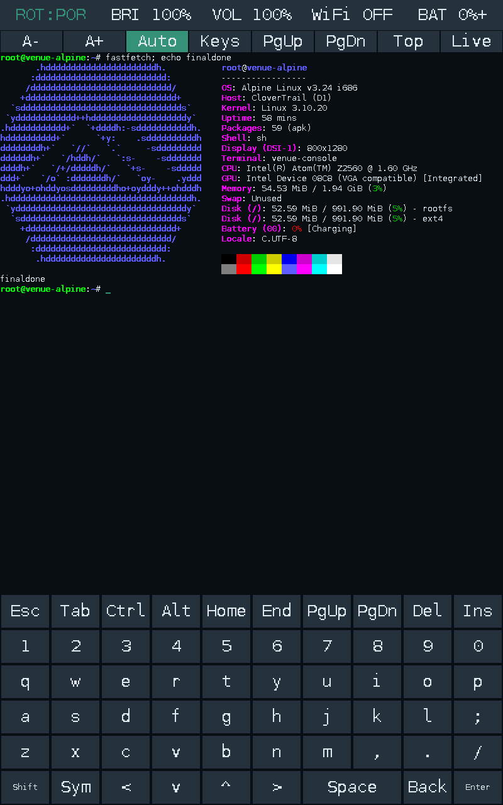
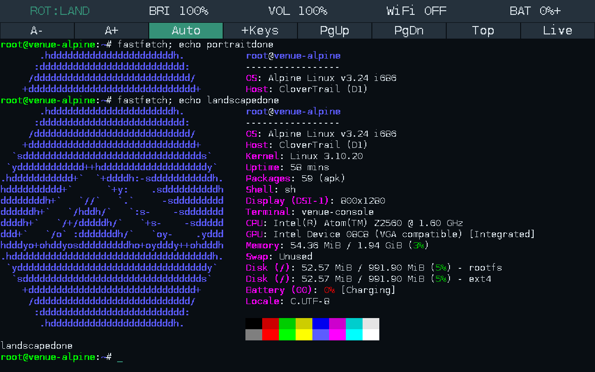

At the end of this, fastfetch looked wonderfully ordinary.

An Alpine logo. An Intel Atom. About 2 GB of RAM. A shell prompt underneath it, waiting for something more interesting to happen.

Getting to that screenshot involved failed kernel exploits, a temporary bootloader downgrade, booting the same kernel twice, recovering from a deleted shell, finding out that an accelerometer can be a surprisingly convincing touchscreen if you ask it to moonlight as one, and learning that a volume control can depend on the difference between **708 and 1220 bytes**.

And as always, life began with Linux. Because it's the happening place.

Put Linux on an old Dell tablet. Simple. Easy. And a good use of my time so that this thing can be a stats screen for my homelab.

Naturally, by reasons of escalation, I ended up building a terminal emulator too.



---

## Wait, who is this?

The device is a **Dell Venue 7 3730**. The 2013 Intel one, codenamed `thunderbird`, with the `P706T_NoModem` hardware profile.

That last bit matters more than the marketing name. Dell made enough similarly named tablets to turn searching for firmware into an exercise in reading the fine print. A Venue 7, a Venue 8, a Venue Pro, and a slightly newer Venue 7 do not suddenly become the same device because a search engine put them next to each other. Thank adb for this.

The actual starting point was:

| Component | What I had |
|---|---|
| CPU | Intel Atom Z2560, Clover Trail |
| Architecture | 32-bit x86 |
| RAM | About 2 GB |
| Display | 800×1280 |
| OS | Android 4.4.2 |
| Kernel | Dell's Linux 3.10.20 |
| Initial access | Unprivileged ADB shell; no `su` |

If you've read [my iPad jailbreaking post](https://axisspri.me/blog/my-journey-with-the-ipad-jailbreaking-pt1), you probably know where this was going. A device that can run a proper shell is immediately more interesting to me than a device that can only run whatever its original app ecosystem still remembers how to install.

This one already had an Intel processor. Excellent.
It was also an Intel processor from the particular period when Intel was trying very hard to make Android tablets happen. Less excellent.
And it was 32-bit. Not getting any better.

---

## I need suuuuuuuuuuuuuuuuuuuuuuuuu

The tablet had already been getting a second job as a cluster dashboard. An Android app on the Venue talked to an aggregator on my control node, a dying HP T505 Thin Client, which was a perfectly reasonable use for an old screen.

Then I wanted more control over the tablet itself. Mainly cause I wanted IT to be the aggregator and a node as well.

At the actual beginning of the root attempt, it was a **stock production build**, not a convenient already-rooted device. The firmware was `TBP706A113300`, Android 4.4.2/API 19, and a normal ADB shell had **UID 2000**, Android's shell user.

The obvious command produced the obvious response:

```text
> adb root
adbd cannot run as root in production builds
```

There was no existing `su` binary or root manager to ask nicely either.

So we inspected fastboot. It identified itself as `clovertrail`, with protocol version **0.5**, but did not expose the ordinary modern Android unlocking interface. The usual unlock-information commands either weren't recognized or produced nothing useful.

That ruled out the comfortable version of the story where I run an unlock command, flash a patched boot image, and "see you space cowboy" off to my next post.

### Towelroot, Houdini, and three different meanings of "compatible"

This was KitKat on a 3.10 kernel, so the historical **Towelroot / CVE-2014-3153** futex vulnerability was an obvious thing to investigate.

The downloaded Towelroot APK contained an ARM native library. The Venue was x86.

At first that looked like the end of that route. Then came **Houdini**, Intel's ARM translation layer, which was installed on the device. Android also advertised `armeabi-v7a` as a secondary ABI. The ARM payload could actually load through the translator.

I also briefly had an x86-capable KingRoot package installed during the initial investigation. It was removed when I got hit by the smell of Big Tencent and adware.

Towelroot reached its wonderfully dated **"make it ra1n"** screen. Thank you, geohot.

Then the APK stopped at a request to its dead reporting server before invoking the kernel exploit.

An old root APK depending on an old web service is a good reminder that the way software is built neeeds to change, sorta. Geohot had betrayed me.

So the next attempt used public **IA/x86 implementations of CVE-2014-3153**, built as static 32-bit executables with musl and run directly from `/data/local/tmp`.

They compiled. They executed. They did not give me root.

One route stalled or restarted the tablet without leaving a usable `su`. A version with an interactive root-shell path did not produce a verified root shell either. An instrumented attempt reached the exploit path, but the watchdog restarted the tablet before it produced useful privileged access.

There was one particularly useful check in the middle of this. A small non-destructive probe asked whether the kernel rejected a priority-inheritance futex requeue onto the **same address**, the argument-validation behaviour added by the relevant fix. Distinct-address controls succeeded, and the same-address operation was accepted too.

The result was deliberately worded:

```text
FIX ABSENT: same-address PI requeue is accepted;
exploitation is NOT established
```

That last line is the entire distinction.

An ARM library loading through Houdini established that it could execute far enough to load. An x86 executable compiling established that its userspace architecture was right. The probe established that the relevant futex rejection was absent.

None of them established that those particular exploits could successfully manipulate this firmware's kernel state and credentials.

They never did.

At that point the generic exploit attempts stopped, the APK and payloads were removed, and the tablet returned to ordinary Android with an unprivileged shell. The dashboard still launched.

Root was still a problem. We had to get a bit more pointed with the attempts.

## The old Dell toolkit had old tricks

The working route came from the archived **Venue 7 Wi-Fi KitKat root kit**, its matching asset kit, and the common helper binaries from **myKIT**.

This was not just a file labelled "Intel root." The device-specific package matched `Venue 7 3730`, `P706T_NoModem`, and the exact v1.33 Android build fingerprint. The downloaded root and asset kit checksums matched the archived metadata. The helper `adbd` and SuperSU binaries were statically linked 32-bit Intel executables, and the installer's mount targets matched the tablet's partition map.

The archive contained a Windows batch launcher. The useful part was reading what the batch file actually did, then carrying out that sequence from Linux.

Its trick was to temporarily install the Venue 7's older **v1.25 Droidboot**, then use a peculiar feature of that boot environment: its `fastboot flash` implementation could place a file into a writable filesystem path, rather like `adb push`.

That allowed a root-capable ADB daemon to be supplied at `/sbin/adbd` in the temporary bootloader environment.

Then this device-specific OEM command changed the active service:

```text
fastboot oem startftm
```

It stopped Droidboot's fastboot service and started ADB in **factory test mode**.

The terminal reported a status-read failure because the fastboot device disappeared during the transition. Which, in this particular sequence, was exactly what the next step needed it to do.

ADB came back.

This time, `id` said:

```text
uid=0(root) gid=0(root)
```

Actual root. Finally.

### Temporary root is not persistent root

That shell lived in the temporary FTM environment. Rebooting without installing anything would not give the normal Android system persistent superuser access.

The x86 **SuperSU** installer supplied that second part. It remounted the Android system partition writable, installed the `su`/`daemonsu` binaries and root-manager APK, and arranged for the daemon to start through `install-recovery.sh`.

The main persistent files were:

```text
/system/xbin/su
/system/xbin/daemonsu
/system/app/Superuser.apk
```

Notice that recovery-script name. Remember it. It comes back later, with a rather different job.

Before returning to Android, the Venue-specific restore package patched Droidboot back through the **v1.26 → v1.31 → v1.33** sequence. The older boot environment was a temporary tool, not the final state I intended to leave installed.

Android then booted normally on the same stock build, and the root files persisted. But the first `su -c id` waited instead of immediately printing a satisfying answer.

Because SuperSU wanted authorization.

Its prompt was present...just rotated for some weird reason. After finding it and granting the ADB shell access, the check succeeded:

```text
uid=0(root) gid=0(root) context=u:r:init:s0
```

A normal ADB shell still reported UID 2000. `su` now provided the explicit route to UID 0. Android's SELinux status was still **Enforcing** in that check.

Another restart confirmed that root survived, the original Android fingerprint was unchanged, and the dashboard package was still installed and launching.

No factory reset or userdata wipe was needed.

This wasn't a general bootloader unlock, and it hadn't replaced Android with Linux just yet. It gave me the persistent privileged Android access needed to read the storage, inspect the kernel and actually try the next experiment.

Which was, of course, to boot something else.

---

## About that postmarketOS idea...

The initial direction was postmarketOS. Which makes sense: old mobile hardware, Linux, a project explicitly interested in keeping devices useful.

Unfortunately, the current official pmaports architecture list does not include **32-bit x86**. The checked recent stable configurations didn't offer an escape hatch either. Archived Clover Trail ports were useful references, but they weren't a maintained installer for this Dell.

And this Atom cannot run an x86_64 image. There isn't a flag that persuades it to evolve like a Pokemon.

The kernel was another constraint. Current userspace assumptions, especially around systemd, are considerably newer than 3.10.20.

So the goal changed to **current 32-bit Alpine userspace on the tablet's own vendor kernel**.

Alpine, my beloved, once again back.

That still left the not-so-small matter of getting it to boot.

---

## Intel decided it would be funny to be different

This machine doesn't expose the ordinary PC boot environment that the Intel badge might make you expect. There is no convenient desktop UEFI setup waiting to offer me an installer menu. The firmware uses Intel's mobile boot machinery, including an **OSIP** structure describing the boot images.

The stock images were marked as signed in Intel's format. The bootloader's secure/unlocked responses did not establish a useful unlock path. Replacing the main kernel with an arbitrary image was not the obvious route forward.

Before the native-kernel experiments, I backed up the pieces that would be extremely unpleasant to reconstruct:

- the beginning and end of the eMMC, including partition-table information;
- the eMMC boot areas;
- the reserved partition holding the stock boot, recovery and Droidboot images;
- factory, configuration and miscellaneous partitions.

There were nine initial images, about **662 MiB** in total, with transfer hashes checked against the device. The partition-table CRCs were checked too.

The first attempt to get a complete Android system-partition backup did not succeed. That matters: having some excellent backups does not magically make them a full-device backup. The complete **1 GiB system image** was obtained and hash-verified later, before the final system-partition conversion.

That distinction became rather useful when I eventually managed to need the recovery work.

But first, there was a better way into Linux.

## The kernel already knew how to leave

The stock kernel had **kexec** support.

Kexec lets an already-running Linux kernel load another kernel and hand execution to it without going through the normal firmware boot cycle. Android is already running Linux, so a rooted Android session can potentially be the launch platform for a different userspace.

Potentially is doing some work there.

A symbol in the kernel and a file called `kexec_loaded` are promising. They aren't a successful boot. Nor did the earlier `su -c id` result prove that the kexec syscall would be usable; it needed its own checks.

The first test was deliberately invalid: invoke the syscall with parameters that must be rejected before any image is loaded. On the tablet, it returned **EINVAL**, rather than the permission failure seen in the unprivileged host test. That established that the privileged path was reachable without actually executing a new kernel.

Then came a real load-and-unload test using the tablet's **own extracted stock kernel**.

The state went:

```text
kexec_loaded: 0 → 1 → 0
```

Good.

Still not a boot.

There was also a read-only Droidboot round trip, so reaching the bootloader and getting back to Android had been exercised before the actual handoff.

### Why use the old kernel again?

Because it was from the machine.

The official Dell source download was not becoming a clean replacement-kernel build. Transfers repeatedly stalled, the archive named `.tar.gz` turned out to contain uncompressed tar data, and the available prefix included a boot command line for **P801**, while my tablet was **P706**.

None of that established a matched, buildable kernel configuration for my device. Once again, Dell fails to understand archival.

Meanwhile, the kernel extracted from this exact tablet was sitting right there.

It was also nonrelocatable, so the load needed to respect the real memory map and x86 setup requirements. This was not the point to improvise generic PC addresses because they looked reassuring in somebody else's tutorial.

The first payload was intentionally small: static i386 BusyBox, a new initramfs, and a USB-accessible diagnostic shell. No permanent root filesystem. No display stack. No internal storage mounted by the diagnostic userspace.

Then the handoff worked.

The relevant output was:

```text
VENUE_RAM_DIAGNOSTIC_SHELL
Linux ... 3.10.20 ... i686
rootfs / rootfs rw
proc /proc proc rw
sysfs /sys sysfs rw
devpts /dev/pts devpts rw
```

The kernel version was still 3.10.20. Of course it was! I had loaded the same kernel with a different initramfs.

The important change was underneath `/`: a new RAM-based userspace, rather than an Alpine directory living inside the old Android process tree.

One slightly less triumphant detail: the automated return monitor timed out. A later check confirmed that Android was back, with zygote running and root working, but the exact return timing was not independently established.

The native boot was real. The neat little recovery-timer story was not fully proven.

---

## Alpine, initially with the training wheels on

Once the RAM-only boot worked, the next step was a persistent **512 MiB ext4 image** stored under Android's userdata filesystem.

The initramfs mounted the image as a loop device and switched into Alpine. The running root was `/dev/loop0`, backed by that file. Android supplied the initial launch environment, then the handoff replaced it.

The userspace was **Alpine 3.24.2 x86**. OpenSSH provided key-only access over USB, and a small board-specific PID 1 brought up the USB network and handled the Intel watchdog.

### The other meaning of root

By now, "root" had two jobs in the conversation: the **UID 0 account**, and the **root filesystem mounted at `/`**.

In Android, SuperSU had given me privileged processes within Android's existing system. In the native boot, the kernel started the new initramfs's `/init` as PID 1, with the privileges needed to mount filesystems and start the replacement userspace. `switch_root` handed that role to Alpine's `/sbin/venue-init`.

There was no need to jailbreak Alpine after booting it. The native supervisor and its child services were already started as root. OpenSSH was configured to accept the installation's authorized key for the root account, with password and keyboard-interactive authentication disabled, and the host pinned the tablet's SSH host key. The screen shell was also started as a root child of the console process.

But a root prompt alone would still have been weak evidence of a native boot. A chroot started by Android could show me a root prompt too.

The useful proof was the process and mount state: the new PID 1, Android's userspace gone after the kexec handoff, and `/dev/loop0` as the running root filesystem. In the final installation, that last part changed to the physical p8 filesystem.

Even BusyBox found a way to contribute a small problem. Its multicall behaviour depends on how it is invoked, and the renamed runtime binary did not select the watchdog applet correctly. Giving it the expected `busybox` name fixed that path.

Software archaeology comes in all kinds.

At this stage, a normal boot still started Android. Alpine was an explicit choice, and the root filesystem survived between launches. A marker written inside Alpine remained there when the image was inspected again.

That was a perfectly useful milestone.

It was also a Linux machine that mostly existed at the other end of a USB cable. The screen, touch input, Wi-Fi and a persistent boot path were still separate problems.

I wanted the tablet itself to be the Linux machine.

## And then I deleted the shell

This is the part where a tidy installation write-up would usually become suspiciously vague. Not me, folks.
I committed a major oopsie, here.
During the attempt to move Alpine onto Android's original system partition, `/system/bin/sh` got deleted before a usable replacement was in place.

ADB shell expected that path.

The boot scripts expected that path.

Being root did not solve the lack of a command interpreter for the interfaces that were supposed to let me use root.

Mea culpa.

The interesting lesson here is that an operating system can be inaccessible without its kernel having vanished. I had broken a very small, very load-bearing piece of the route into the machine.

Recovering execution meant going back through the Intel recovery machinery. The **v1.25 Droidboot/FTM route that had originally supplied root** became useful for a second time, now as a way back into the broken installation.

There was one extra problem this time: a rooted ADB daemon still couldn't launch the deleted `/system/bin/sh`. Its shell-path string was patched to `/sbin/sh`, where a static shell could be supplied. A small path correction was enough to get a command interpreter back into reach.

Which is a deeply funny resolution to a problem caused by deleting a command interpreter.

The recovery didn't end with "ADB works now, probably fine." The original Droidboot image was restored from this unit's own backup, and the image readback and both OSIP header copies were checked.

There was another trap here: the temporary downgrade had allocated a different image slot. Restoring it couldn't assume that the live slot was still sitting at the original offset.

This is why the backups needed to describe the actual device, rather than a collection of files with hopeful names.

---

## The final boot path is a small chain of very specific compromises

After recovering shell access, the working Alpine filesystem was copied onto the physical **`/dev/mmcblk0p8`** ext4 partition, the original 1 GiB Android system partition.

The complete original system image was preserved. Userdata was retained, including the earlier Alpine image.

The main signed boot image stayed in place.

That sounds contradictory until you look at the handoff:

```text
firmware
  ↓
original signed boot image and stock init
  ↓
/system/etc/install-recovery.sh
  ↓
kexec: own-device kernel + Alpine initramfs
  ↓
mount mmcblk0p8 and switch_root
  ↓
/sbin/venue-init
  ↓
native Alpine, USB SSH, display and terminal
```

The stock init already had a root service invoking `install-recovery.sh`. That supplied the automatic bootstrap into the new system without replacing the signed main boot image.

But the shell problem wasn't quite finished with me.

### `/bin/sh` now had two jobs

During the initial Android bootstrap, the shell needed to work before Alpine was the running root. After the switch, it needed to behave like Alpine's normal shell.

The solution was a small statically linked bridge:

- in the bootstrap environment, execute the static BusyBox shell under `/system/boot/`;
- in the native root, delegate to Alpine's `/bin/ash`.

The first distinction I might reasonably want to use was "does `/etc/alpine-release` exist?"

Unfortunately, Android's `/etc` points into `/system`. Once Alpine files were installed there, the release file could be visible *before* the root switch.

So the test needed to identify the environment, rather than merely recognize a file belonging to the next environment.

The relevant check became:

```c
if (access("/bin/ash", X_OK) == 0) {
    execv("/bin/ash", argv);
}
```

A very small distinction. A rather important one when the thing making the distinction is `/bin/sh`.

The resulting system booted automatically after reboot. Its root mount was the real p8 filesystem, PID 1 was the native supervisor, and persistent writes survived a changed kernel boot ID.

At last, "installed" meant something more substantial than "it answered once over USB."

---

## There is a screen. Where is the console?

The vendor kernel could drive the panel, but it did not provide a usable **fbcon** path for a normal Linux text console.

The available route was `/dev/fb0`.

On this tablet, that meant:

```text
800 × 1280 pixels
32 bits per pixel
3200 bytes per physical row
```

So the frontend became a small C program drawing directly into the framebuffer. A PTY supplied the other half: the shell and programs got terminal file descriptors, while the frontend rendered their output and sent touch-keyboard input back to them.

The first version used an 8×16 bitmap font and a simple on-screen keyboard. It was enough to get an actual shell onto the actual tablet screen.

Then the touchscreen did not behave like a touchscreen.

### Because it was an accelerometer

The input-device selection was too generous. An absolute-axis query succeeding was being treated as proof that a device had useful multitouch coordinates.

That selected the wrong device, whose queried axis ranges were effectively useless for this purpose, because they detected motion.

The selection needed to verify the ranges, not just the syscall result. The actual **ft5416** controller reported X from `0..799` and Y from `0..1279`.

Suddenly, tapping a key typed the key.

The sort of feature one generally hopes a keyboard will provide.

### Seizure warning, framebuffer painting

The first renderer cleared and repainted the live framebuffer on each update. The panel was scanning out the same memory that the program was busy erasing.

So typing produced an extremely enthusiastic visual effect.

The fix was to compose into an off-screen buffer, compare it with the previous frame, and copy only changed physical rows into the live framebuffer.

No live-screen clearing between characters. No need to interpret every keypress as an occasion for a flashbang.

Colours came next: per-cell foreground and background state, standard and bright ANSI colours, the 256-colour palette, RGB true colour, bold, underline and reverse video.

The important part was storing those attributes with the cells. Recolouring the entire screen based on the latest escape sequence would have been a very creative interpretation of a terminal.

So what if I rewrote a compositor? What's it to you? :p

---

## The network problem was partly on my laptop

USB networking had been the lifeline from the first native boot, so it became the first dependable management route for the installed system too.

The tablet exposed a RNDIS interface, and the laptop used a NetworkManager shared connection to provide routing and DNS.

Then internet sharing ran into Docker's **FORWARD drop policy** on the host.

The tablet could be reachable locally while its forwarded traffic still went nowhere. The fix was a narrowly scoped NetworkManager dispatcher rule for this particular USB link, rather than changing the firewall policy for everything else on the laptop.

After that, internet ping, DNS, signed APK repository updates and installing packages such as nano worked.

Wi-Fi needed the tablet's **BCM4330** driver, firmware and calibration data. The original provisioned MAC address was restored from the configuration backup instead of leaving the driver's generic address in place.

Wpa_supplicant and DHCP were wired into the native startup. Wi-Fi got the preferred route, with USB assigned a lower-priority route for fallback use.

There were successful wireless SSH, internet and reboot-reconnection checks.

The brick could speak to the big towers in the cloud.

---

## A Linux tablet should probably act a little like a tablet

Once the shell was usable, the keyboard needed the keys I actually use in a shell.

Arrows. Tab. Escape. Ctrl and Alt. Home and End. Paging and editing keys. Brackets, braces, a pipe and a backslash without having to contemplate the meaning of suffering first.

The result was a Termux-style expanded keyboard with a punctuation page and held-key repeat.

Then came a portrait/landscape switch and a status bar for brightness, volume, Wi-Fi and battery state. Rotation had to change the drawing and touch mappings together. Merely rotating the text would leave the keyboard's hit targets somewhere in an alternate universe.

It also had to resize the **same PTY**, so applications received the new terminal dimensions without the shell being restarted.

Brightness came from the panel's backlight sysfs interface. Wireless status was cached by a separate helper, so a slow network query could not stall the input loop.

Orientation, brightness and volume settings survived a reboot test using deliberately non-default values: **landscape, 70% brightness, 55% volume**.

But "volume" had required its own little detour.

## 708 bytes walked into a 1220-byte ioctl

The real audio codec was exposed as ALSA card 2, `cloverview_audio`.

Modern amixer could list the controls. Reading their values failed with:

```text
Control hw:2 element read error: Not a tty
```

This was not the codec announcing that it wanted to become a terminal.

An ioctl number includes information about the operation and the size of its data structure. The userspace and kernel have to agree on that contract.

Upstream i386 ALSA's control-value structure was **708 bytes**. Dell's vendor kernel expected **1220 bytes**, including a **1024-byte value union**.

The modern request therefore had the wrong encoded size. The vendor ioctl handler rejected it.

A size-correct probe succeeded, reading a speakerphone digital playback level of **204 out of 228**, or roughly **89%**. A small compatibility adapter then made percentage reads and writes work for the speakerphone and headset digital playback controls.

The compile-time assertion was quite literal:

```c
_Static_assert(sizeof(VenueControlValue) == 1220,
               "Dell vendor ALSA value ABI");
```

That unlocked a real mixer-backed status value and slider.

It did not prove audible playback or correct speaker routing. I'll do those eventually.


### Meanwhile, the battery had some opinions about arithmetic

The battery widget initially displayed the vendor driver's percentage directly.

Then it displayed zero.

Checking the rest of the gauge produced something more interesting:

| Driver-reported value | Reading |
|---|---:|
| Percentage | 0% |
| Voltage | About 4.07 V |
| Status | Charging |
| Full-charge capacity | 0 |
| Remaining charge | About 4511 mAh |
| Design capacity | 4100 mAh |

The kernel log also contained repeated gauge communication/programming failures, including I2C errors in ROM mode with return code **−121**.

That points toward a fuel-gauge initialization or calibration problem in the native boot environment. The exact underlying cause is still unconfirmed.

Voltage alone cannot tell me the real percentage, but this collection of capacity readings is not a trustworthy description of an empty battery either.

The bar still displays the driver's bad `0%` at the time of writing. It should eventually say **unknown** when the gauge data is invalid. I am not going to turn 4.07 V into a confident, invented percentage just to make the screenshot prettier.

---

## Fastfetch finally asked the terminal to be a terminal

At this point I could type commands, rotate the screen and change hardware settings.

Then I ran fastfetch.

Its output broke the layout.

My first suspicion was that the terminal had the wrong resolution. The actual panel resolution was fine. The **character grid** was the problem, along with the parser attached to it.

The original portrait font was scaled to 16×32 pixels, which gave me **50 columns**. Fastfetch's Alpine logo and some complete information lines needed roughly **100**.

It also sends a request to disable automatic line wrapping:

```text
CSI ? 7 l
```

The homegrown parser ignored it and wrapped anyway. So the logo and information kept falling into rows that fastfetch did not expect to be using.

Declaring `TERM=xterm-256color` had given applications rather more confidence in the frontend than the frontend had earned.

Fair enough.

### So the small parser got replaced

The framebuffer and touchscreen frontend stayed, but the terminal engine moved to **libvterm 0.3.3**, statically linked into the i386 binary.

That brought proper handling for wrap modes, cursor controls, UTF-8 cell widths, scroll regions, alternate screens and live-screen reflow. The frontend supplied actual window and cell-size query responses, and the PTY reported both its character dimensions and text-area pixel dimensions.

The font gained Latin-1 and common box-drawing, block and arrow glyphs. That is still a bounded bitmap font rather than a promise to render every possible Unicode symbol, but the parser now understands that a character's bytes and its occupied cells are not the same thing.

The malformed-output tests also caught signed integer overflow in the library's numeric parser. Inspection showed that the CSI argument count needed a guard too. The local changes clamp oversized CSI/OSC numeric values and discard CSI sequences with more than 16 parameters.

Replacing my parser with an established library was the sensible architectural decision.

Keeping the tests was also the sensible decision.

### And the terminal learned to scroll

The frontend now keeps **2048 lines of scrollback**, retaining colours and attributes. Dragging down reveals older output; dragging up returns toward newer output.

There are page, top and live controls. Shift+PgUp/PgDn work too. If new output arrives while I am reading history, the view stays anchored instead of helpfully relocating the paragraph I was in the middle of reading.

Typing returns to the live prompt. Full-screen alternate-buffer applications keep their redraws separate from shell history.

Font size can be changed independently of the keyboard labels, and the keyboard can be hidden to reclaim the lower part of the display.

The automatic layouts ended up at:

| Layout | Keyboard visible | Keyboard hidden |
|---|---:|---:|
| Portrait | 100×53 cells | 100×74 cells |
| Landscape | 106×19 cells | 106×29 cells |

Those are terminal cells. The physical panel is still 800×1280, which is what fastfetch's Display module reports even when the userspace UI is rotated.

The useful outcome was that the actual fastfetch logo and complete CPU/GPU information finally lined up.
Mostly. Sometimes I had shit like this:



---

## "It looks right" needed a little more evidence

By this point, trusting a nice screenshot alone would have been a rather optimistic conclusion to draw from the rest of the project.

The checks went through several layers:

- **Boot:** changed kernel boot IDs, the physical p8 root mount, native PID 1 and persistent file readback.
- **Terminal engine:** colours, attributes, wrap behaviour, UTF-8, alternate screens, bounded history and malformed output under address/undefined-behaviour sanitizers.
- **Layout:** portrait/landscape coordinate maps, framebuffer bounds, PTY resizing and stable redraws.
- **Input:** injected real evdev touch events, then captured the resulting PTY bytes for arrows, Tab, modifiers and held-key repeat.
- **Hardware controls:** brightness and mixer changes checked by actual readback.
- **Fastfetch:** execution through the touchscreen keyboard, complete OS/CPU/GPU lines on the displayed rows, and real framebuffer captures in both orientations.
- **Scrollback:** numbered output lines, swipe/page navigation, staying anchored as output arrives, and retaining history through zoom and keyboard-visibility changes.

The framebuffer colour checks counted expected RGB pixels after sending real terminal output through the PTY. The scroll tests checked which numbered line actually occupied the top of the historical view.

That made the results a lot more useful than an assertion that the draw function had called another draw function.

It also made the familiar engineering lesson difficult to avoid: a component returning successfully does not prove that the whole thing is doing what I think it is doing. It may be doing something else entirely.

An input ioctl had succeeded for the wrong device. An audio device had existed behind the wrong userspace ABI. A release file had existed in the wrong boot environment. A terminal had advertised capabilities that its parser didn't implement.


---

## So what did I actually end up with?

**Native Alpine 3.24.2 on the original system partition**, booting automatically through the stock signed boot path and kexec, with its own PID 1.

A framebuffer terminal with a real PTY, touch keyboard, ANSI colours, UTF-8 handling, scrollback, zoom, keyboard hiding and manual orientation switching.

Working USB SSH and USB-shared internet. Wi-Fi integration that has passed successful connection and internet checks, but is currently unreliable on the weak link I was testing. Real brightness and mixer controls. A battery gauge whose reported percentage needs considerably more suspicion than its status bar was initially giving it.

The original Droidboot was restored and checked. The original Android system image is backed up. The main signed boot image remains the boot entry point.

What I have not produced is a maintained postmarketOS port or a modern tablet desktop. The kernel is still **3.10.20**. Audible playback, suspend and broader power-management behaviour haven't been established. Seeing a GPU name in fastfetch does not establish a modern accelerated graphics stack.

Those are the edges of the result, rather than details to quietly crop out of the picture.

But the result itself is real.

The device now boots into a system I can inspect, use, resize, scroll and connect to. The final root filesystem was using only roughly **53 MiB** of its 1 GiB partition, which is an almost offensively small amount of storage for how much work it took to reach it.

I started by trying to put Linux on a tablet.

I finished with a boot chain I could explain, a recovery path I had actually needed, and a terminal whose deficiencies had been demonstrated by a program drawing an Alpine logo.

Fastfetch is not usually a hardware bring-up milestone.

This time, it earned the position.

**P.S.** AI was used to debug and brainstorm. The text here is all mine. There was rather more work between "try it" and "it works" than a cleaned-up command list would suggest.


**P.P.S** I'll upload all the backups for archival soon, as well as the bootchain itself.

## Links

- [The public CVE-2014-3153 implementation investigated](https://github.com/timwr/CVE-2014-3153)
- [The IA/x86 Towelroot implementation investigated](https://github.com/geekben/towelroot)
- [Intel Android device root/recovery toolkit discussion](https://xdaforums.com/t/intel-android-devices-root-temp-recovery-session.2975096/)
- [Alpine Linux](https://www.alpinelinux.org/)
- [postmarketOS pmaports](https://gitlab.postmarketos.org/postmarketOS/pmaports)
- [Dell's Venue 7 3730 open-source directory](https://opensource.dell.com/releases/Venue_7_3730_CloverTrail_plus/)
- [libvterm](https://github.com/neovim/libvterm)
- [The earlier iPad experiment](https://axisspri.me/blog/my-journey-with-the-ipad-jailbreaking-pt1)
